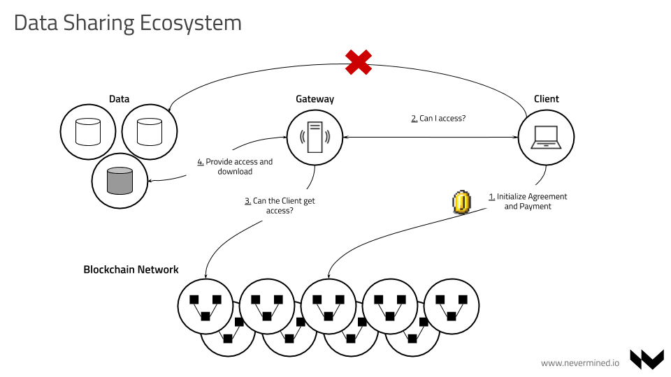
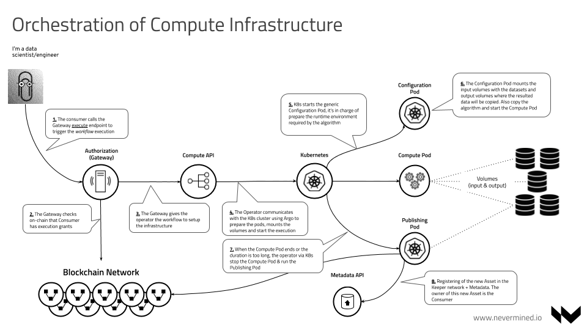
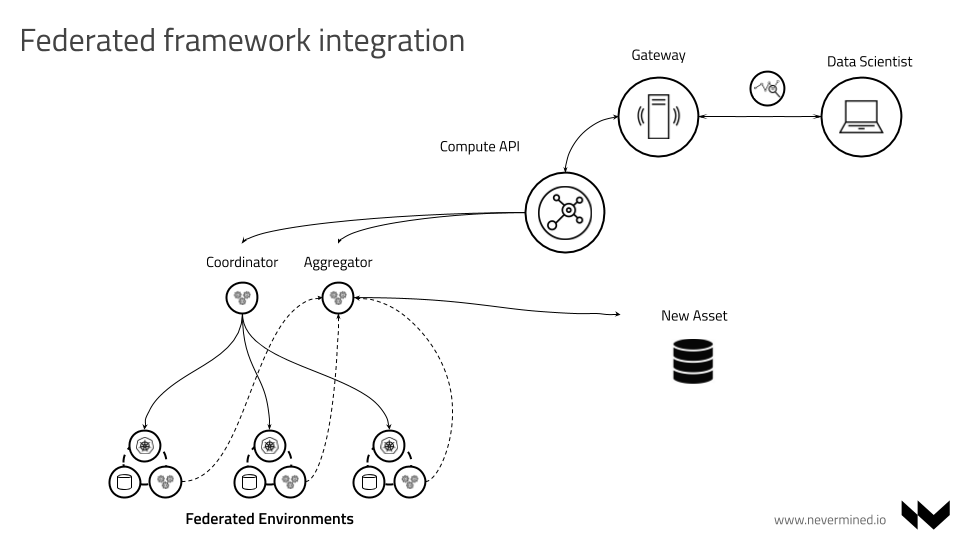

# Nevermined Architecture

* [Nevermined Architecture](#nevermined-architecture)
   * [Introduction](#introduction)
   * [Data Ecosystem Principles](#data-ecosystem-principles)
   * [Use Cases](#use-cases)
   * [Capabilities](#capabilities)
      * [Data Sharing](#data-sharing)
      * [Data In Situ Computation](#compute-to-the-data)
         * [Compute backends](#compute-backends)
            * [Kubernetes backend](#kubernetes-backend)
            * [Federated Learning backend](#federated-learning-backend)
      * [Data Marketplace and Cataloging](#data-marketplace-and-cataloging)
   * [Architecture](#architecture)
      * [Technical components](#technical-components)
   * [Nevermined Specifications (Specs)](#nevermined-specifications-specs)

---

## Introduction

Nevermined is a data ecosystem solution that provides the capabilities of
building bespoke networks where different entities can share and monetize their
data and make an efficient and secure usage of it even with untrusted parties.

With the explosion of the data and AI market, entities have the necessity of
organizing, understanding, using and sharing their data internally and
externally. Nevermined provides Data Sharing & Data In Situ Computation solutions
allowing to unlock data for AI.

Nevermined enables a __“Data In Situ Computation”__ solution, meaning the data never
moves, is the algorithm the one moving where the data is. It allows data owners
or providers to define the conditions in which they allow others to make use of
their data without giving direct access to it.

Nevermined is designed to be integrated in Big Data environments. It enables
monetizing the data without migration. It’s also designed for GDPR compliance,
it never stores any personal information on-chain (encrypted or in plain text).

Nevermined is the product powered by [Keyko](https://keyko.io) providing Data
Sharing & Data In Situ Computation solutions allowing to unlock data for AI.

## Data Ecosystem Principles

During the design and construction of Nevermined, we identified 6 key factors
for the adoption and usage of a data ecosystem and its continued growth:

* Culture - Culture & Organization help to establish how each ecosystem actor
  interact with others.  We promote it giving a user centric approach
* User Experience (UX) - The ecosystems should provide an excellent User
  eXperience, facilitating the participation of all the partners and users
* Trust - Data ecosystems must promote trustful environments where untrusted
  parties can collaborate
* Integrity - Data integrity and provenance as first class citizens where the
  ecosystem users can validate that data doesn't change and from where is coming
* Compliance - Data first approach compliance with all the data regulatory
  requirements
* Incentives - We promote the usage and retention of data ecosystems via
  gamification and providing additional value

## Use Cases

Nevermined is a platform agnostic solution enabling data use cases where
different parties don't trust each other.
It allows to provide data ecosystems where **DATA OWNERS** need to share and
monetize their data with third-party people, but they want to keep the privacy
and the control of their data.

Typical use cases for sector are:

* Banking - Data Sharing with the regulator or internal across different
  jurisdictions
* Telco - Anonymized Data Sharing with the regulator and partners. AI within
  moving the data  
* Health & Pharma - AI over medical results of different hospitals without
  revealing PI
* Supply Chain - Provenance, integrity and tracking of goods
* Automotive - Data Sharing for AI to promote the autonomous cars
* Others - Real estate, digital assets tokenization, ..

## Capabilities

Nevermined is based in three core building blocks:

### Data Sharing

It enables the data sharing capabilities between unstructured parties.
The main users involved in this scenario are:

* Organizations with data that need to share and monetize (**Data Owners**).
* Organizations or individuals looking for data sets to train their models
  (**Data Consumers**).

Typically Data Owners & Consumers don't know or trust each other. Nevermined
provides a generic solution where both can share data in a decentralized and
secure way. The main benefits for them are:

* Data Owners can get some benefit of their existing data
* Data Consumers can get access to datasets they couldn't get access in other conditions

In this use case the CONSUMERS can get access to the datasets, so it's ideal for
 problems with low data privacy constraints.

The main capabilities are:

* Allowing data monetization. Data owners can make available their data and get
  some rewards/benefits when others get access to it.
* Allows an easy data publishing or data access from the users.
* Provides a Decentralized Access Control where untrusted members can feel
  confident that other members of the system will play honestly
* Supports free or paid access scenarios
* All the interactions related with the assets or services (when are created in
  the system, who has access, when the access was granted, etc.) is tracked
* The decentralized access control can be used in public or private blockchain
  networks

You can find more details about the technical implementation of the Data Sharing
 use case in the [ACCESS SPEC](specs/access/README.md).

### Data In Situ Computation (DISC)

It facilitates the use cases where data owners allow third parties to execute
some algorithms where the data is.

For the use cases with more privacy restrictions in which the Data Owner never
wants to lose control of their data, and this source data can't be accessed
directly, Nevermined provides a Data In Situ Computation solution.

This scenario is based on the premise that data doesn't want to be moved.
Moving data of their existing premises is a liability. The data can be leaked in
 transit and because the private nature of the data, moving it implies some
 regulatory issues. In that case, Nevermined provides a solution where the Data
 Owner allows the execution of an algorithm (tensorflow, spark, etc.) in the
 infrastructure where the data is. It means the Data Consumer provides the
 algorithm to execute, and this is moved to the Data Owner infrastructure where
 the data is being kept.

The Data Consumer receives the result of the execution of the algorithm on top
of the data.

You can find more details about the technical implementation of the Data In Situ Computation use case in the
[COMPUTE SPEC](specs/compute/README.md).

The main capabilities of the Data In Situ Computation building block are:

* Solution designed to support different computation or backend paradigms
* Implemented 2 different backends, one of them orchestrating Kubernetes
  containers in the Data Provider environment. Other via the integration of a
  Federated Learning framework
* Framework or programming language independent
* The data never moves, algorithm goes where data is
* Consumer never get access to the real data
* The algorithm is moved where the data is. An ephemeral environment is created
  to support the computation
* It supports the orchestration of computing pipelines
* All the access control and execution is controlled via the integration with
  the service agreements
* Can be run in cloud providers or on-premise
* Permits the monitoring of the workflows execution

#### Compute backends

Nevermined supports to plug different compute backends that could be more
convenient depending on the use cases. The rest of the ecosystem keeps the same
(services, api’s, applications on top, etc.), but depending on how the use case
is, Nevermined will orchestrate the compute jobs in different ways. At this
point in time Nevermined integrates 2 different compute backends:

##### Kubernetes backend

This backend is perfect for compute jobs that can be executed in the data
provider data center and don’t have high privacy constraints. In this scenario
the Client can implement the algorithm using different languages or frameworks,
and the Nevermined Compute solution will be in charge of orchestrating the
infrastructure for moving the algorithm where the data is.

As you can see in the above diagram, the Compute API will be in charge of
triggering the compute workflow interacting with the Kubernetes infrastructure
via [Argo](https://argoproj.github.io/). This includes:

* Download the algorithm provided by the Data Scientist/Engineer
* Starts the right Docker container in the infrastructure
* Mount as volume with the data
* Execute the algorithm passing as parameter the path where the data is mounted
* Stop the Compute pod where the algorithm is running
* Publishing the result as a new asset
* Destroy all the ephemeral environment

##### Federated Learning backend

This backend fits for the execution of federated learning jobs using the data of
 providers having federated environments.  In this scenario the Client can
 implement the data training model using a generic federated learning framework,
  and the Nevermined Compute solution will be in charge of orchestrating the
  execution across all the participants.

In this scenario the Compute backend starts two independent tasks, the
coordinator and the aggregator. The coordinator will do all the management of
the participants as part of a federated job. The aggregator will do the secure
aggregation of the trained models. Both the coordinator and aggregator are
ephemeral nodes created by demand, so after the job is executed they will be
stopped till a new execution request is triggered.

### Data Marketplace and Cataloging

It facilitates the search, discovery and management of the existing assets in
the data ecosystem. The main capabilities are:

* Improved User Experience
* Integration with the Data Governance and Data Catalog tools
* Easy search and discovery
* Native integration with the data sharing and data in situ computation building blocks
* Internal data catalog and APIs
* Tokenization and incentives

## Architecture

### Technical components

The complete description of the [architecture components](components.md) & licenses can be found [here](components.md).

A brief summary of some of them:

* [SMART CONTRACTS](https://github.com/nevermined-io/contracts) - Solidity Smart Contracts providing the Service
  Agreements business logic.
* [GATEWAY](https://github.com/nevermined-io/gateway) - Microservice to be executed by PUBLISHERS. It exposes an
  HTTP REST API permitting access to PUBLISHER assets or additional services such as computation.
* [METADATA-API](https://github.com/nevermined-io/metadata-api) - Microservice to be executed by MARKETPLACES.
  Facilitates   creating, updating, deleting and searching the asset metadata registered by the PUBLISHERS.
  This metadata is included as part of a DDO (see [DID SPEC](specs/did/README.md) and
  [METADATA SPEC](specs/metadata/README.md)) and also includes the services associated with the asset (consumption,
  computation, etc.).
* [SDK](sdk) - Software library encapsulating the Nevermined business logic. It's used to interact with all the
  components & APIs of the system. It's currently implemented in the following packages:
  - [nevermined-sdk-js](https://github.com/nevermined-io/sdk-js) - JavaScript version of the Nevermined SDK to be
    integrated with front-end applications.
  - [nevermined-sdk-py](https://github.com/nevermined-io/sdk-py) - Python version of the Nevermined SDK to be
    integrated with back-end applications. The primary users are data scientists.
  - [nevermined-sdk-java](https://github.com/nevermined-io/sdk-java) - Java version of the Nevermined SDK to be
    integrated with [JVM](https://en.wikipedia.org/wiki/Java_virtual_machine) applications. The primary users are
    data engineers.
* MARKETPLACE - Exposes a web interface allowing users to publish and purchase assets.
  It also facilitates the discovery of assets.

## Nevermined Specifications (Specs)

The core of the platform is documented in detail in Specification documents (aka SPECs).
Here you can find a list of the most relevant SPECs:

Short Name              | Title                                             | Version      | Status     | Editor
------------------------|---------------------------------------------------|--------------|------------|-------
[DID](specs/did)        | Decentralized Identifiers                         | 0.1          | Raw        | [@aaitor](https://github.com/aaitor)
[META](specs/metadata)  | Metadata                                          | 0.1          | Raw        | [@aaitor](https://github.com/aaitor)
[ACCESS](specs/access)  | Decentralized Access Control                      | 0.1          | Raw        | [@aaitor](https://github.com/aaitor)
[COMPUTE](specs/compute)| Data In Situ Computation                          | 0.1          | Raw        | [@aaitor](https://github.com/aaitor)
[FL](specs/fl)          | Federated Learning Orchestration                  | 0.1          | Raw        | [@rodolphe](https://github.com/r-marques)
[PROV](specs/provenance)| Decentralized Data Provenance                     | 0.1          | Raw        | [@aaitor](https://github.com/aaitor)
[IDM](specs/id_management)| Identity management with on-chain access control  | 0.1          | Raw        | [@aaitor](https://github.com/aaitor)

The DID, META, ACCESS & COMPUTE specs are an evolution of
[Ocean Protocol Enhancement Proposals - OEPs](https://github.com/oceanprotocol/OEPs/).
