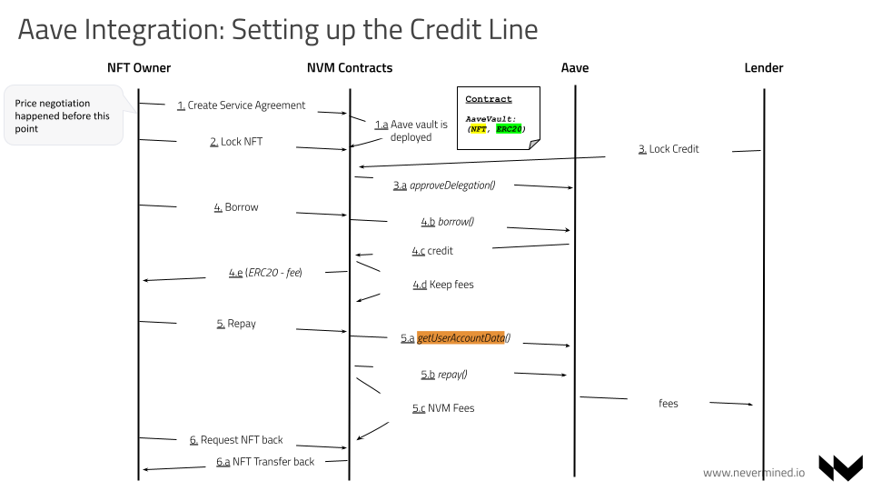
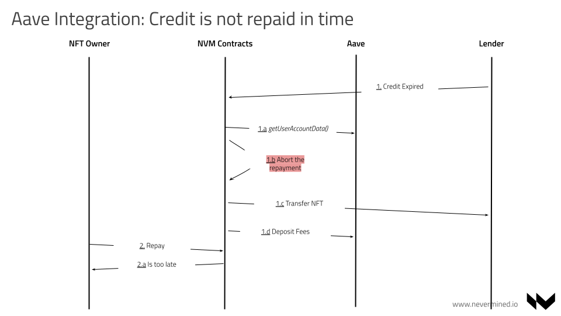

# NFTs collateralization via Nevermined and Aave integration

```
shortname:      AAV-NFT
name:           NFT Collateral Agreements
type:           Standard
status:         Draft
version:        0.1
```

Table of Contents
=================

   * [NFTs collateralization via Nevermined and Aave integration](#nfts-collateralization-via-nevermined-and-aave-integration)
      * [Price discovery](#price-discovery)
      * [Value](#value)
      * [Integration Details](#integration-details)
      * [Architecture](#architecture)
         * [User Flows](#user-flows)
            * [Setting up the credit](#setting-up-the-credit)
            * [What happens when credit is not repaid in time](#what-happens-when-credit-is-not-repaid-in-time)
         * [Aave credit template](#aave-credit-template)


---


[Nevermined](https://nevermined.io/) is an Open Source solution developed by [Keyko](https://keyko.io/), offering the users the ability to build ecosystems where untrusted parties can share and monetize their digital assets in a way that’s efficient, secure and privacy preserving. On top of this Nevermined provides the mechanisms to tokenize these digital assets allowing content creators to trade and transfer them in a secure way. It is designed to support the following use cases:

* Art publishing, exhibition, selling. Secondary market
* Collection of objects
* Tokenization of digital and physical assets (real estate, etc.)

Using this baseline, Nevermined will provide to digital assets owners the possibility of leverage them via their utilization in Decentralized Finance (DeFi) scenarios.

In this document we introduce the architecture of Nevermined integrating Aave protocol. This will allow the NFT marketplaces built on Nevermined to augment their existing functionality for their communities allowing loans using NFTs as collateral. This functionality will be offered as a library for these marketplaces, providing new functionalities without lower level integrations with Nevermined or Aave protocols.


## Price discovery

Assets price discovery is a complex topic **out of the scope of this integration**. The focus of this specific integration is to allow NFT owners (ERC-721) to use them as collateral for their loans.
The process of negotiating between Lenders and Borrowers can be done via marketplace (see [nftfi](https://www.nftfi.com/)).
One of the key factors in setting up a credit collateralized by an asset is how to establish that asset price. Depending on the use case there are different options:

* No external interaction. Pure negotiation between lender and borrower. Auctions or additional mechanisms can be used.
* Central or distributed independent authority (notary) setting up independent valuations. In the art sector can be curators, real estate can be a local authority. Notaries can be rewarded and be curated themselves by the network.
* Each non-fungible asset is associated with a token (ERC20 or ERC1155) and its own AMM. Users can stake/add liquidity, working as automatic way to curate the assets.

On top of the price of an asset different credit conditions can be established (repayment period and assets).


## Value

The integration of Aave into Nevermined brings is valuable because:

- Facilitate for NFT owners to put their assets at work
- Bring more usage to Aave protocol
- Bring more usage to Nevermined


## Integration Details

The integration of Aave require the modification and delivery of the following components:

* The [Nevermined Contracts](https://github.com/nevermined-io/contracts). It will be necessary to extend the Service Agreements to provide a new template and the conditions required to execute a fully end-to-end scenario with the different options.
* [SDK-JS](https://github.com/nevermined-io/sdk-js). Javascript library exposing the Nevermined service agreements for an easier integration


## Architecture

### User Flows

The final goal is to have a fully functional end to end integration, allowing for the users to ask for a credit backed by their NFTs (ERC-721):


#### Setting up the credit



This is the happy path for a end-to-end flow. Steps:

1. The **Borrower** or **NFT Owner** initialize a service agreement on-chain.
   This service agreement will be based in a new template: `AaveCreditTemplate`.
1. The **Borrower** lock the NFT in the Vault contract via NVM **NFTLock** condition
1. The **Lender** lock the payment in NVM via the **AaveCollateralDeposit** condition
1. The **Borrower** borrow from NVM via **AaveBorrowCredit** condition
1. After some time the **Borrower** repays the credit through NVM fulfilling the **AaveRepayCredit** condition
1. The **Borrower** request transfer back the NFT to NVM via **TransferNFT** condition


#### What happens when credit is not repaid in time

In the case the credit is not repaid in time, the borrower will get the NFT in return:



Steps:

1. The **Borrower** try to repay the credit when this was expired
1. The contracts check via the Aave `getUserAccountData` contract call if the credit already expired
1. If that is the case, the contract will fulfill the condition and transfer the NFT to the Lender
1. In addition to this the pending fees will be transfered to Aave

This scenario can happens also if the **Lender** inform about a credit expired via **AaveRepayCredit** condition


### Aave credit template

NVM will provide a new template integrating the following conditions:

1. Lock NFT - When called by the **Borrower** will lock the ERC-721 NFT into the Aave Vault
1. Aave Collateral Deposit - When called by the **Lender** will lock the credit funds into the Aave Vault and approve the delegation into Aave
1. Aave Borrow Credit - When called by the **Borrower** will borrow the credit funds from Aave Vault
1. Aave Repay Credit - When called by the **Borrower** will repay the credit funds into Aave Vault
1. Transfer NFT - When called by the **Borrower** or the **Lender** will transfer the NFT to one of them depending if credit was repaid in time or not
1. Distribute Payment - Distribute the payments and fees between the users depending of the above conditions
