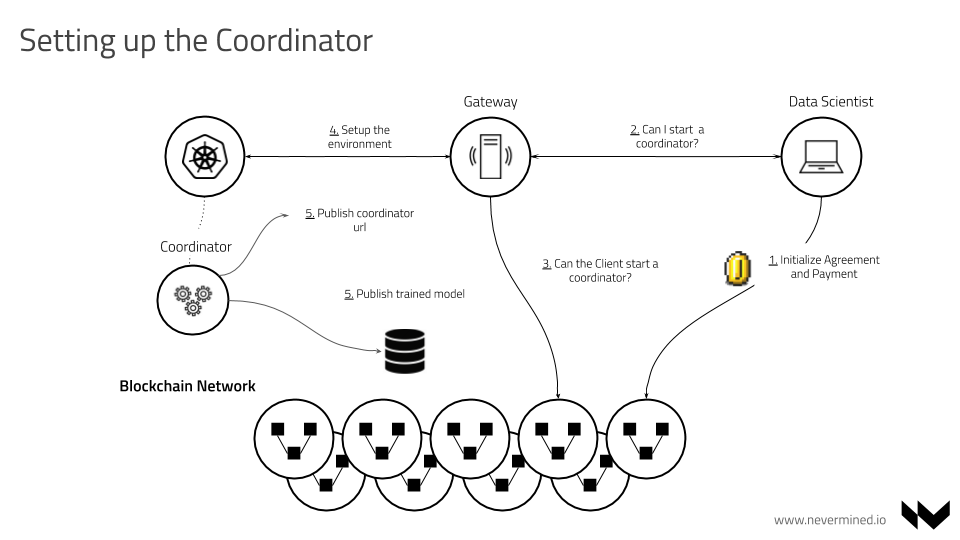
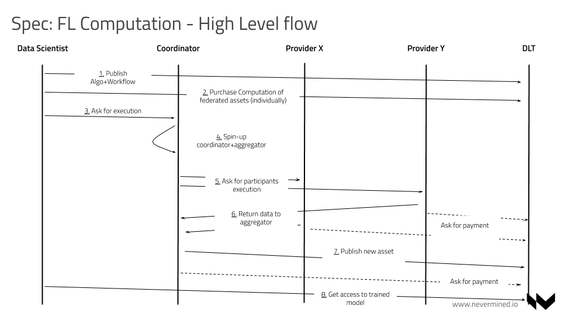

# COMPUTE FL: Decentralized Federated Learning Orchestration

```
shortname:      FL
name:           Decentralized Federated Learning Orchestration
type:           Draft
status:         Valid
version:        0.1
editor:         Rodolphe Marques <rodolphe@keyko.io>
contributors:   Aitor Argomaniz <aitor@keyko.io>,
                Enrique Ruiz <kike@keyko.io>
```


* [COMPUTE FL: Decentralized Federated Learning Orchestration](#compute-fl-decentralized-federated-learning-orchestration)
* [Table of Contents](#table-of-contents)
   * [Federated Learning integration in the Nevermined Compute to Data](#federated-learning-integration-in-the-nevermined-compute-to-data)
   * [Terminology](#terminology)
   * [Motivation](#motivation)
   * [Actors](#actors)
   * [Architecture](#architecture)
      * [Running the Coordinator](#running-the-coordinator)
      * [Flow](#flow)
      * [Running the Participants](#running-the-participants)
      * [Flow](#flow-1)
   * [Federated Learning Session Flow](#federated-learning-session-flow)


---


## Federated Learning integration in the Nevermined Compute to Data

This SPEC introduces the integration pattern for the usage a Federated Learning
backend in the [Nevermined Compute to the Data architecture](architecture/specs/compute/README.md).

The Nevermined Compute to the Data solution introduces a solution where
different compute backends can be plugged in order to support different remote
computation use cases.   

This spec details how Federated Learning sessions could be executed on
Nevermined.


## Terminology

* **Coordinator**: All the components required to perform the coordination of a
  Federated Learning session. The components provided by the
  [xain-fl](https://github.com/keyko-io/xain-fl) framework (coordinator +
    aggregator)
* **Participant**: Component responsible for interacting with the coordinator
  and executing the machine learning task over the data.
* **Federated Learning Session**: The time from setup of the coordinator to the
  successful execution of the machine learning plan. Typically this involves
  coordinating the participants for a finite number or rounds and then storing
  the resulting model


## Motivation

The main motivations of this SPEC are:

* Identify the actors involved in the execution of a Federated Learning session
  on Nevermined
* Identify the integration points between the xain framework components and the
  Nevermined components
* Detail the execution flow of a Federated Learning session on Nevermined


## Actors

The different actors interacting in this flow are:

* PROVIDERS: Give access to the Compute Services and to the data
* CONSUMERS: Want to make use of the Compute Services and access to data
* MARKETPLACE or DOMAINS: Store the DDO/Metadata related to the Assets/services
* INFRASTRUCTURE: Infrastructure required to run the Nevermined compute stack

Here we may have two types of providers. A normal provider like the one
specified in Compute to the data spec. And another type of provider that only
provides compute but now access to the data (to run the coordinator).

## Architecture

### Running the Coordinator

This section details how a Client/Data Scientist can setup and run a Coordinator
 using Nevermined Compute.

The main requirements are:

* A COMPUTE PROVIDER or PROVIDER defines the conditions that a Compute service
supports. It includes:
  - What kind of image (Docker container) can be deployed in the infrastructure
  - What are the infrastructure resources available (CPU, memory, storage)
  - What is the price of using the infrastructure resources
  - Allow incoming connections for the Participants
* A COMSUMER defines the parameters of the coordinator and creates an execution
  workflow using a predefined coordinator workflow template
  - This is a different type of workflow with no inputs, outputs and access to
  data
* A CONSUMER purchasing a compute service defines which Workflow (DID) is going
to execute





### Flow

1. The CONSUMER / Data Scientist locks the payment for the service
1. The CONSUMER / Data scientist provides a DID for the workflow to execute
   - The gateway could potentially provide specific endpoints for this since the
   workflow is always the same. The only thing that changes is the parameters to
    configure the coordinator
1. The Gateway checks if the CONSUMER / Data scientist as the permissions to
  start a new coordinator
1. The Nevermined compute stack starts a new coordinator
1. The url to connect to the coordinator is published (need to figure out how)
1. In the meantime participants will connect to the coordinator and the coordinator will orchestrate the Federated Learning session
1. After the Federated Learning session is finished the coordinator publishes the resulting trained model and shuts down.


### Running the Participants

This section details how a Client/Data Scientist can setup and run a set of
Participants using Nevermined Compute.

This should be simpler to integrate because it’s very similar to the compute to
the data use case. The main difference being that the algorithm is actually
wrapped around the xain python sdk and it needs to be able to perform outgoing
network connection to connect to the coordinator.


The main requirements are:

* A PROVIDER defines the conditions that a Compute service supports. It includes:
  - What kind of image (Docker container) can be deployed in the infrastructure
  - What are the infrastructure resources available (CPU, memory, storage)
  - What is the price of using the infrastructure resources
* A COMPUTE PROVIDER defines a Compute Service in the scope of the Asset
  (DID/DDO) of the dataset that can be computed
* A CONSUMER defines the task to execute modeling it in a Workflow (including
  configuration, input, participant)
* In this case the transformation is just the participant code
* It does not need to produce any output since that is handled by the
  coordinator
* A workflow is a new type of Asset. It can be resolvable and be used across
  multiple independent compute services
* A CONSUMER purchasing a compute service defines which Workflow (DID) is going
  to execute


### Flow

1. The CONSUMER / Data Scientist locks the payment
1. The CONSUMER / Data Scientist requests the execution of the participant
1. The Gateway checks if the CONSUMER / Data Scientist has the permissions to
   execute the participant on the data
1. The Nevermined compute sets up the environment
1. The participants access the data and performs the machine learning task
1. The participant needs to be able to communicate with the coordinator
   throughout the entire Federated Learning session.
1. The coordinator will be external to the Infrastructure Provider
1. The participant does not need to create a new asset since that is handled by
   the coordinator


## Federated Learning Session Flow

This section details a high level overview of a Federated Learning Session using
 two different data providers.

 


The Data Scientist starts by finding a provider to run the Coordinator compute
job and the data that it requires (possibly using the marketplace).

The flow is:

1. The Data Scientist starts by setting the execution parameters for the coordinator and publishes it as a workflow/ddo
1. The Data Scientist purchases compute to the data for both Data Provider X and Y and defines the workflow/ddo with the code that will run the participants
1. The Data Scientist purchases the Coordinator compute service
1. The Data Scientist starts the Coordinator
1. The Data Scientist starts the participants
1. The Participants work together with the coordinator over the course of multiple rounds as defined in point 1.
1. Once all rounds are finished the Coordinator publishes the final trained model
1. The Data Scientist fetches the trained model.
